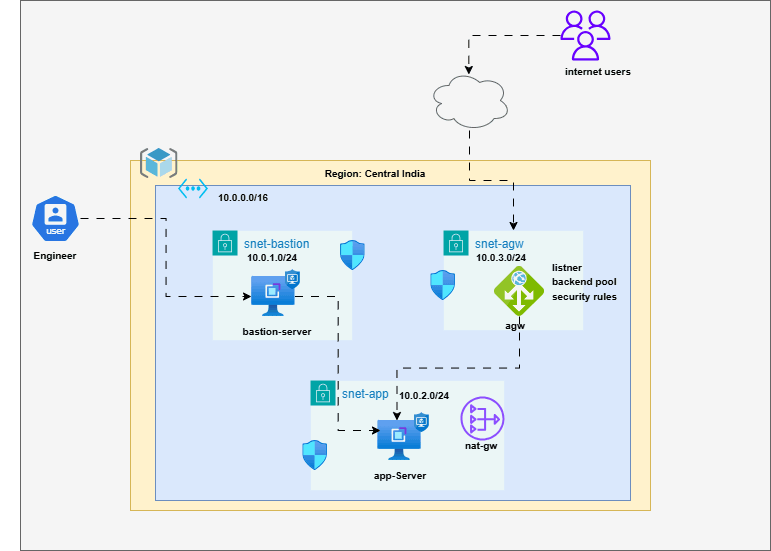

# Azure Mini Project – End-to-End Application Deployment using Application Gateway & NAT Gateway

## Project Objective

This project demonstrates a secure Azure infrastructure architecture where:

* A Bastion VM is used as:

  * Jump Server
  * Build Server
  * Management Server

* An Application VM hosts the application privately.

* Azure Application Gateway exposes the application publicly.

* NAT Gateway provides outbound internet access for private resources.

* Application is finally accessed through browser using Application Gateway Public IP on Port 80.

---

# Architecture Overview


```text
                           INTERNET
                               |
                               |
                     Public IP (AGW)
                               |
                    +-------------------+
                    | Application GW    |
                    | Reverse Proxy     |
                    +-------------------+
                               |
                               |
                    Private Backend Traffic
                               |
                    +-------------------+
                    | Application VM    |
                    | Private IP Only   |
                    +-------------------+
                               |
                               |
                     Outbound Internet
                          via NAT
                               |
                    +-------------------+
                    | NAT Gateway       |
                    +-------------------+
                               |
                            INTERNET


        -------------------------------------------------

                    Admin / DevOps Access Flow

                           Admin Laptop
                                  |
                           Public Internet
                                  |
                     Public IP (Bastion VM)
                                  |
                          +----------------+
                          | Bastion VM     |
                          | Build Server   |
                          +----------------+
                                  |
                              SSH / SCP
                                  |
                          +----------------+
                          | Application VM |
                          +----------------+
```

---

# Azure Components Used

| Component           | Purpose                        |
| ------------------- | ------------------------------ |
| Resource Group      | Logical grouping of resources  |
| Virtual Network     | Private network infrastructure |
| Bastion VM          | Jump server + Build server     |
| Application VM      | Hosts application privately    |
| Public IP           | Public connectivity            |
| NAT Gateway         | Outbound internet access       |
| Application Gateway | Layer 7 reverse proxy          |
| NSG                 | Security rules                 |
| Subnets             | Network segmentation           |

---

# Azure Region

```text
Central India
```

---

# Resource Naming Convention

| Resource Type       | Resource Name     |
| ------------------- | ----------------- |
| Resource Group      | rg-mini-project   |
| Virtual Network     | vnet-mini-project |
| Bastion Subnet      | snet-bastion      |
| Application Subnet  | snet-app          |
| AGW Subnet          | snet-agw          |
| Bastion VM          | vm-bastion        |
| Application VM      | vm-app            |
| NAT Gateway         | nat-mini-project  |
| Application Gateway | agw-mini-project  |

---

# Network Design

## VNET Configuration

```text
VNET Name       : vnet-mini-project
Address Space   : 10.0.0.0/16
```

---

# Subnet Design

| Subnet       | CIDR         |
| ------------ | ------------ |
| snet-bastion | 10.0.1.0/24 |
| snet-app     | 10.0.2.0/24 |
| snet-agw     | 10.0.3.0/24 |

---

# STEP 1 – Create Resource Group

## Purpose

Resource Group acts as a logical container for all Azure resources.

## Azure Portal Steps

1. Open Azure Portal
2. Search "Resource Groups"
3. Click "Create"
4. Enter:

```text
Resource Group Name : rg-mini-project
Region              : Central India
```

5. Click Review + Create
6. Click Create

---

# STEP 2 – Create Virtual Network

## Purpose

VNET provides private networking between Azure resources.

## Azure Portal Steps

1. Search "Virtual Networks"
2. Click Create
3. Enter:

```text
Name            : vnet-mini-project
Region          : Central India
Address Space   : 10.0.0.0/16
```

---

## Create Subnets

### Bastion Subnet

```text
Subnet Name : snet-bastion
CIDR        : 10.0.1.0/24
```

### Application Subnet

```text
Subnet Name : snet-app
CIDR        : 10.0.2.0/24
```

### AGW Subnet

```text
Subnet Name : snet-agw
CIDR        : 10.0.3.0/24
```

Click Create.

---

# STEP 3 – Create Bastion VM

# Purpose

Bastion VM will be used for:

* SSH Access
* Jump Server
* Build Server
* Artifact Copy
* Management Activities

---

# Configuration

| Setting   | Value             |
| --------- | ----------------- |
| VM Name   | vm-bastion        |
| OS        | Ubuntu 22.04      |
| Public IP | YES               |
| VNET      | vnet-mini-project |
| Subnet    | snet-bastion      |

---

# Important Concept

Only Bastion VM is public.

Application VM remains private.

This architecture improves security.

---

# STEP 4 – Create Application VM

# Purpose

This VM hosts the application.

---

# Configuration

| Setting    | Value             |
| ---------- | ----------------- |
| VM Name    | vm-app            |
| OS         | Ubuntu 22.04      |
| Public IP  | NO                |
| Private IP | YES               |
| VNET       | vnet-mini-project |
| Subnet     | snet-app          |

---

# Important Security Concept

Application VM should NEVER have Public IP.

Access should happen only through:

* Bastion VM
* Application Gateway

---

# STEP 5 – Create NAT Gateway

# What is NAT Gateway?

NAT Gateway provides:

```text
Secure Outbound Internet Access
```

for private resources.

---

# Why NAT Gateway?

Application VM has NO Public IP.

Without NAT Gateway:

* VM cannot install packages
* VM cannot download updates
* VM cannot access internet
* VM cannot pull repositories

---

# NAT Gateway Traffic Flow

```text
Application VM
      |
Private Traffic
      |
NAT Gateway
      |
Internet
```

---

# Azure Portal Steps

1. Search "NAT Gateway"
2. Click Create
3. Enter:

```text
Name   : nat-mini-project
Region : Central India
```

4. Create Public IP
5. Associate subnet:

```text
snet-app
```

6. Click Create

---

# STEP 6 – Create Application Gateway

# What is Application Gateway?

Application Gateway is:

```text
Layer 7 Load Balancer + Reverse Proxy
```

It works on:

```text
HTTP / HTTPS
```

---

# Application Gateway Responsibilities

* Accept client traffic
* Forward traffic to backend VM
* Perform health checks
* Reverse proxy
* SSL termination (optional)

---

# Application Gateway Architecture Flow

```text
User Browser
      |
Public Request
      |
Application Gateway
      |
Private Backend Request
      |
Application VM
```

---

# Azure Portal Steps

1. Search "Application Gateway"
2. Click Create
3. Enter:

```text
Name       : agw-mini-project
Tier       : Standard_v2
Subnet     : snet-agw
Public IP  : YES
```

---

# Backend Pool Configuration

Add:

```text
Application VM Private IP
```

to backend pool.

---

# Listener Configuration

```text
Frontend Port : 80
Protocol      : HTTP
```

---

# Health Probe Configuration

```text
Protocol : HTTP
Port     : 80
Path     : /
```

---

# Routing Rule

```text
Listener ---> Backend Pool
```

---

# STEP 7 – Configure NSG Rules

# Bastion NSG Rules

| Source   | Port | Purpose    |
| -------- | ---- | ---------- |
| Internet | 22   | SSH Access |

---

# Application VM NSG Rules

| Source         | Port | Purpose      |
| -------------- | ---- | ------------ |
| Bastion Subnet | 22   | SSH          |
| AGW Subnet     | 80   | HTTP Traffic |

---

# Security Best Practice

DO NOT ALLOW:

```text
Internet ---> Application VM
```

directly.

---

# STEP 8 – Install Required Packages on Bastion VM

## Connect to Bastion VM

```bash
ssh azureuser@BASTION_PUBLIC_IP
```

---

# Install Git

```bash
sudo apt update
sudo apt install git -y
```

---

# Install NGINX (Optional)

```bash
sudo apt install nginx -y
```

---

# Clone Application Repository

```bash
git clone <repo-url>
```

---

# Build Application

Example:

```bash
cd application
npm install
npm run build
```

OR for static website simply prepare HTML files.

---

# STEP 9 – Copy Build to Application VM

## SCP Command

```bash
scp -r app-folder azureuser@APP_PRIVATE_IP:/home/azureuser/
```

---

# Traffic Flow

```text
Bastion VM
     |
SSH / SCP
     |
Application VM
```

---

# STEP 10 – Deploy Application on Application VM

# Connect to Application VM

From Bastion:

```bash
ssh azureuser@APP_PRIVATE_IP
```

---

# Install NGINX

```bash
sudo apt update
sudo apt install nginx -y
```

---

# Copy Application Files

```bash
sudo cp -r app/* /var/www/html/
```

---

# Start NGINX

```bash
sudo systemctl enable nginx
sudo systemctl start nginx
```

---

# Verify NGINX

```bash
sudo systemctl status nginx
```

---

# STEP 11 – Validate Internal Connectivity

# From Bastion VM

```bash
curl http://APP_PRIVATE_IP
```

Expected Result:

```text
Application HTML Response
```

---

# STEP 12 – Validate External Connectivity

Open browser:

```text
http://APPLICATION_GATEWAY_PUBLIC_IP
```

Expected Result:

```text
Application should load successfully
```

---

# End-to-End Traffic Flow

# 1. Admin Access Flow

```text
Admin Laptop
      |
Internet
      |
Bastion Public IP
      |
Bastion VM
      |
SSH
      |
Application VM
```

---

# 2. User Application Flow

```text
User Browser
      |
Internet
      |
Application Gateway
      |
Private Backend Routing
      |
Application VM
```

---

# 3. Outbound Internet Flow

```text
Application VM
      |
Private Subnet
      |
NAT Gateway
      |
Internet
```

---

# Why This Architecture is Good?

| Feature             | Benefit                   |
| ------------------- | ------------------------- |
| Private App VM      | Better security           |
| Bastion Access      | Controlled administration |
| NAT Gateway         | Secure outbound access    |
| Application Gateway | Reverse proxy             |
| NSG Rules           | Traffic control           |
| Separate Subnets    | Isolation                 |

---

# Real-World Concepts Covered

This project demonstrates:

* Reverse Proxy
* Jump Server
* Private Backend Architecture
* Layer 7 Load Balancer
* Secure Infrastructure
* Outbound NAT
* Network Segmentation
* Application Exposure Design

---

# Optional Enhancements

Future improvements:

* HTTPS Enablement
* SSL Certificates
* WAF Enablement
* Azure Key Vault
* VMSS
* Autoscaling
* CI/CD Pipeline
* Azure Monitor
* Log Analytics

---

# Common Interview Questions

## Q1. Why use Application Gateway?

Because it provides:

* Layer 7 Routing
* Reverse Proxy
* SSL Offloading
* WAF Support

---

## Q2. Why use NAT Gateway?

To provide secure outbound internet connectivity to private resources.

---

## Q3. Why keep Application VM private?

To reduce attack surface and improve security.

---

## Q4. Why use Bastion VM?

To centralize administrative access securely.

---

# Final Architecture Summary

```text
                INTERNET
                    |
                    |
        Application Gateway (Public)
                    |
            Application VM (Private)
                    |
               NAT Gateway
                    |
                INTERNET


                Admin Access
                    |
                Bastion VM
                    |
             Application VM
```

---

# Conclusion

This Azure mini project demonstrates a production-style architecture using:

* Application Gateway
* NAT Gateway
* Bastion VM
* Private Backend VM
* Secure Networking
* Reverse Proxy Design

This project is excellent for:

* Azure Networking Learning
* Team KT Sessions
* Infrastructure Demonstrations
* Interview Preparation
* Hands-on Practice

---
Thanks
